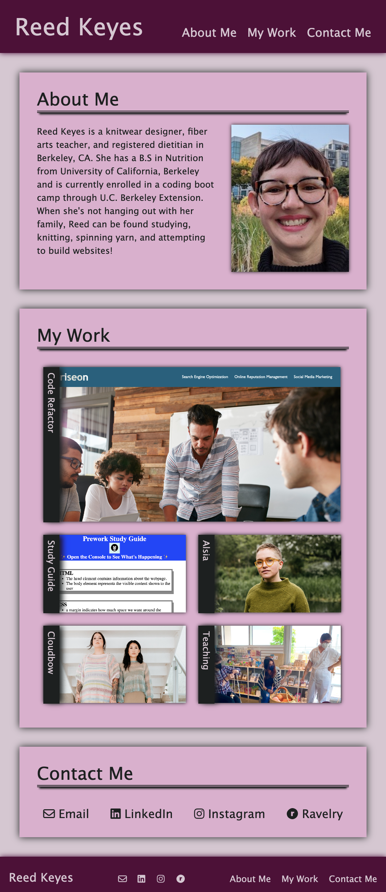

# reed-keyes-portfolio-page

## Description

I designed this webpage to serve as a portfolio to showcase my professional work as a developer and beyond (Note: at this time, I am still working to build my portfolio as a web developer. In the meantime, I have provided links to my publications and teaching as placeholders, with the intention of creating either a separate section or entirely new page for these categories at a future date). This was an excellent opportunity for me to practice flexbox in order to create a responsive portfolio page.

[Link to deployed portfolio]()

## Table of Contents (Optional)

- [Usage](#usage)
- [Credits](#credits)
- [License](#license)

## Usage

This page includes intra-page navigation links in both the header and footer to the "About Me", "My Work" and "Contact Me" sections of the page. The images in the "My Work" serve as hyperlinks to my project pages. There links to my email and social media in both the "Contact Me" section as well as the page footer. The format of the page adjusts as screen width decreases, to improve ease of viewing across a wide array of devices.

## Credits

[Tutorial: text overlay on image](https://www.w3schools.com/howto/howto_css_image_text.asp)

[Tutorial: writing-mode for vertical text](https://developer.mozilla.org/en-US/docs/Web/CSS/writing-mode)

[Article on responsive text in CSS](https://blog.logrocket.com/the-elements-of-responsive-typography/)

[Tutorial: add box-shadow to only one edge of element](https://stackoverflow.com/questions/5115427/how-can-i-add-a-box-shadow-on-one-side-of-an-element)

[README guide](https://coding-boot-camp.github.io/full-stack/github/professional-readme-guide)
## License

MIT License

Copyright (c) [2022] [Reed Tatum Keyes]

Permission is hereby granted, free of charge, to any person obtaining a copy
of this software and associated documentation files (the "Software"), to deal
in the Software without restriction, including without limitation the rights
to use, copy, modify, merge, publish, distribute, sublicense, and/or sell
copies of the Software, and to permit persons to whom the Software is
furnished to do so, subject to the following conditions:

The above copyright notice and this permission notice shall be included in all
copies or substantial portions of the Software.

THE SOFTWARE IS PROVIDED "AS IS", WITHOUT WARRANTY OF ANY KIND, EXPRESS OR
IMPLIED, INCLUDING BUT NOT LIMITED TO THE WARRANTIES OF MERCHANTABILITY,
FITNESS FOR A PARTICULAR PURPOSE AND NONINFRINGEMENT. IN NO EVENT SHALL THE
AUTHORS OR COPYRIGHT HOLDERS BE LIABLE FOR ANY CLAIM, DAMAGES OR OTHER
LIABILITY, WHETHER IN AN ACTION OF CONTRACT, TORT OR OTHERWISE, ARISING FROM,
OUT OF OR IN CONNECTION WITH THE SOFTWARE OR THE USE OR OTHER DEALINGS IN THE
SOFTWARE.